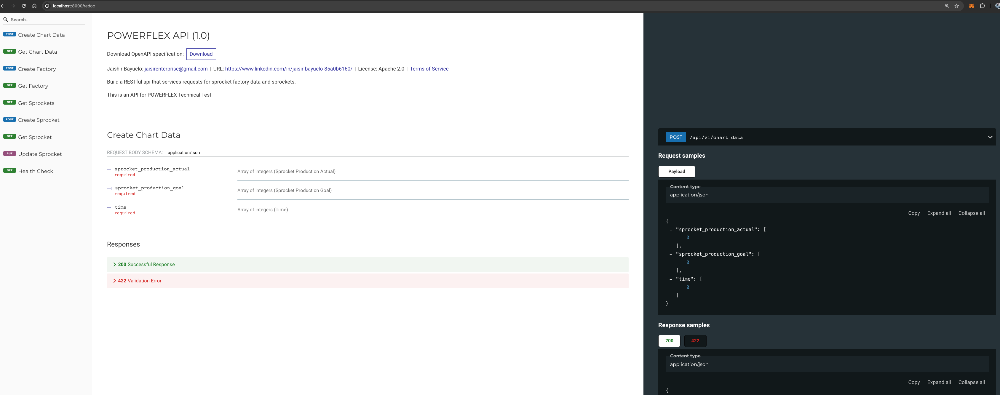
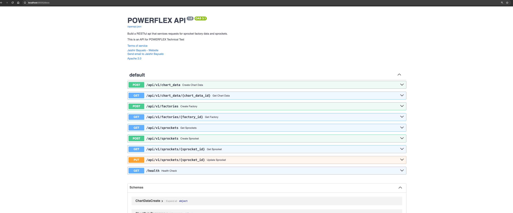
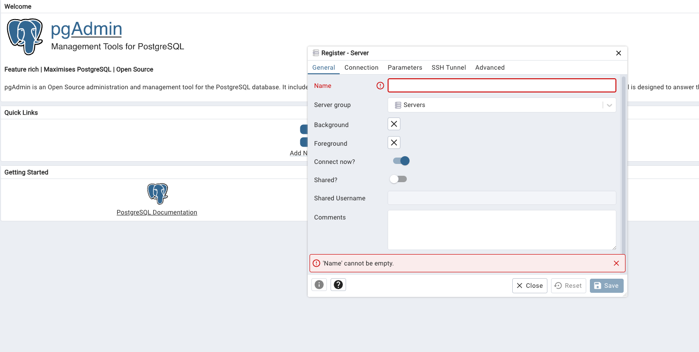
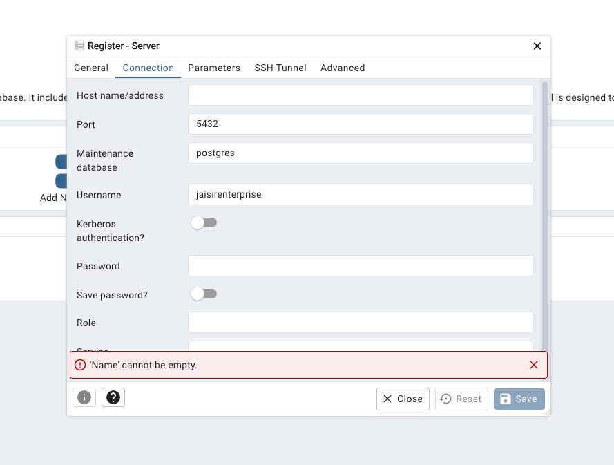
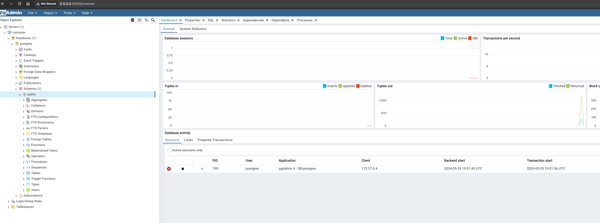
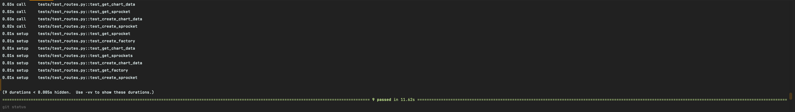

# PowerFlex Technical Test

This document guides you through setting up and running the PowerFlex technical test project.

## Challenge Definition

Python or NodeJS or Typescript Backend Challenge

Task:
Build a RESTful api that services requests for sprocket factory data and sprockets.
The app should be built using either Python or NodeJS or Typescript.
For data retention, a database or cache can be used.
Ideally, use docker/docker-compose for standing up the datastore.
The code should be on a github repository that should be shared with your engineering contact.

### Requirements:
RESTful Endpoints
An endpoint that returns all sprocket factory data
An endpoint that returns factory data for a given factory id
An endpoint that returns sprockets for a given id
An endpoint that will create new sprocket
An endpoint that will update sprocket for a given id
   -  Seed data/examples of the factory and sprocket are in the attached JSON files
   -  Include a README with instructions on how to stand up the database and application


## Home API


## Project Setup

### Prerequisites

* Docker and Docker Compose
* Visual Studio Code (VSCode)
* `make` (installed in your terminal)

### Configuration

1. **Environment Variables:** Duplicate `dev_template.env` and rename the copy to `dev.env`.
2. **Credentials:** Enter the required credentials in `dev.env`.  Use any desired values for the Postgres credentials.

## Cloning the Project

3. **Recommended:** Use the "Clone in VS Code" option to clone the project repository.

## Running the Project

4. **Open Terminal:** Launch a terminal within your project directory.
5. **Build:**
   ```bash
   make build
   ```
6. Run the following command in the terminal to check if containers are up:
   ```bash
   docker ps
   ```
7. After the containers are up, we need to wait around 1 minute for the db and container initialize correctly and apply migrations in root folder:
   ```bash
   make apply-migrations
   ```


8. If you find a ConnectionRefused is because you need to wait a couple of seconds more while postgres container is ready. Then:
Please run again `make build` to guarantee the app is connected to db and `make apply-migrations`

### Viewing Logs
8. To view the logs of the app, run:
   ```bash
   docker logs -f --tail 100 api
   ```

### If you want to open the code inside devcontainer: VSCode Configuration (Mac)
This devcontainer.json has a special setup for developing and guarantees high quality code with its tools.
9. Press `CMD + SHIFT + P` inside VSCode.
10. Select "Reopen Folder and Build Container" from the options.
11. Choose the `devcontainer.json` file inside the `.devcontainer` folder.


### Clean project
12. If you want to delete containers:
   ```bash
   make down
   ```

13. If you want to remove database go to `.devcontainer` folder and remove `db_data` directory
14. If you want to see the database and browse it, this project has a container for `pgadmin` so:
    - Go to: `http://localhost:5050`
    - Use the credentials you setup in dev.env for pgadmin
    - Add a new server
    
    - In `name` you can put whatever you want
    - I `connection tab` in hostname you must put `database`
    
    - In `maintenance database` put the name of your db of `dev.env` referring to POSTGRES
    - `Username` the same one from `dev.env` referring to POSTGRES
    - `Password` the same one from `dev.env` referring to POSTGRES
    
    - Finally, you will have something like that


15. If you want to see the docs for the endpoints:
    - Go to: `http://localhost:8000/redoc` or `http://localhost:8000/docs` 
    
    

   
## To run the tests
16. You can run:
   ```bash
   make run_tests
   ```

