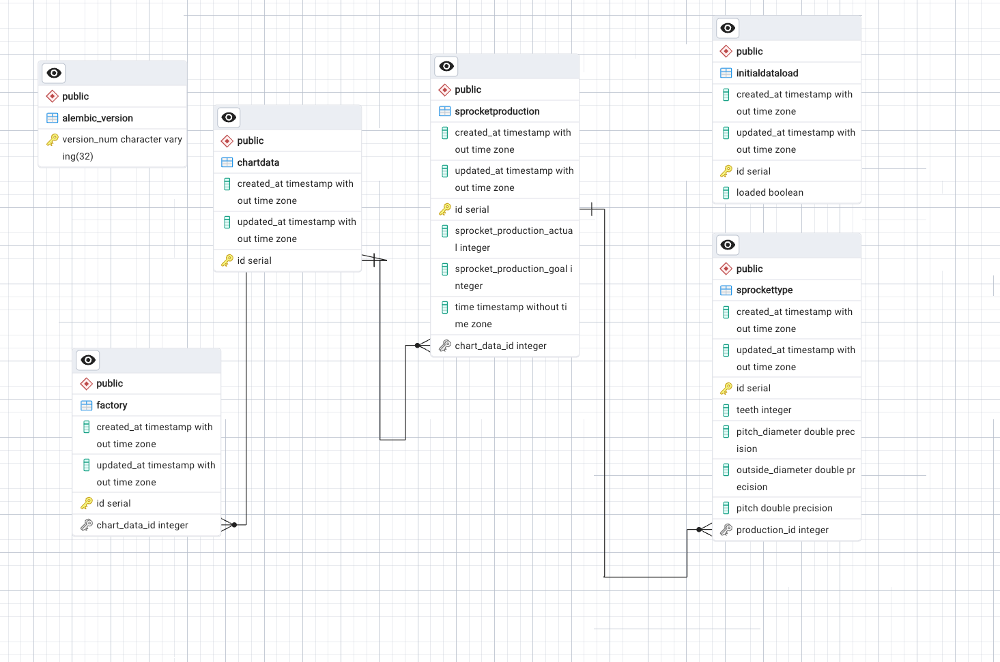
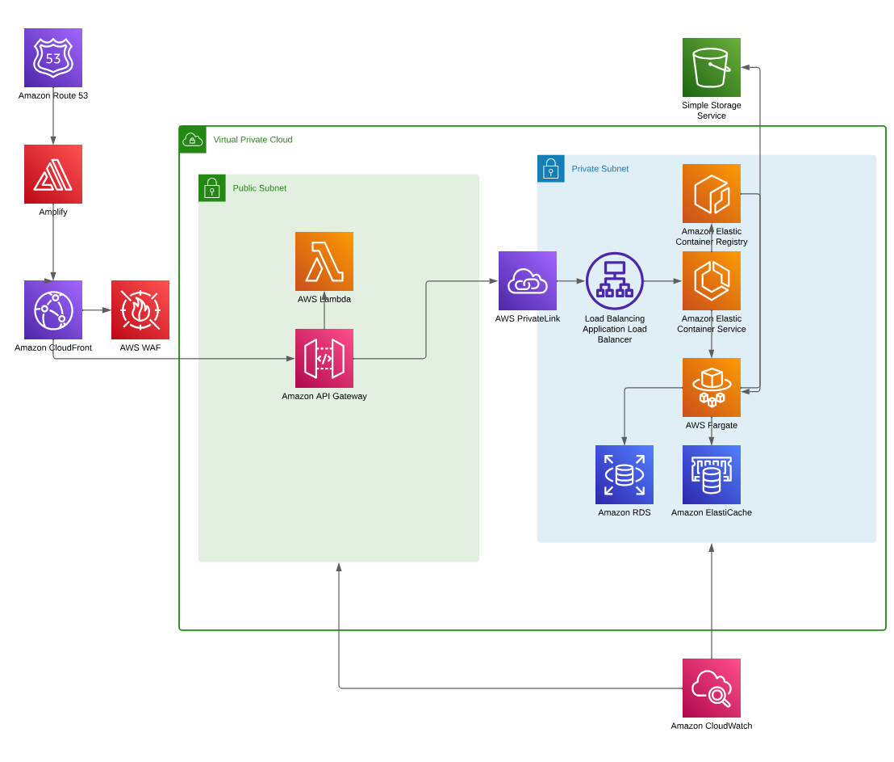
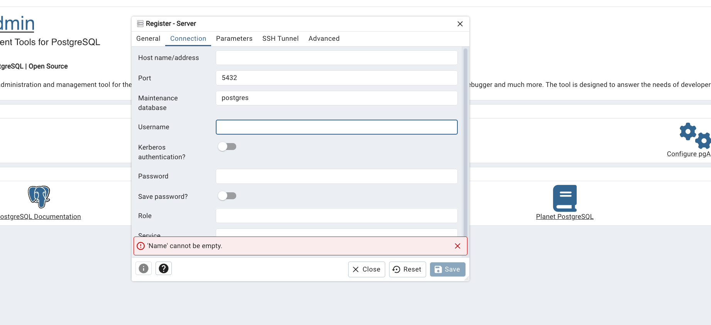
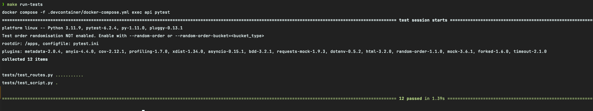
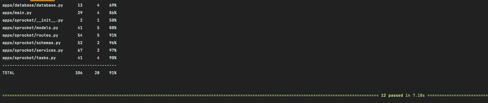

# PowerFlex Technical Test

This document guides you through setting up, solution and running the PowerFlex technical test project.

## Challenge Definition

Python or NodeJS or Typescript Backend Challenge

Task:
Build a RESTful api that services requests for sprocket factory data and sprockets.
The app should be built using either Python or NodeJS or Typescript.
For data retention, a database or cache can be used.
Ideally, use docker/docker-compose for standing up the datastore.
The code should be on a github repository that should be shared with your engineering contact.

### Requirements:
RESTful Endpoints
An endpoint that returns all sprocket factory data
An endpoint that returns factory data for a given factory id
An endpoint that returns sprockets for a given id
An endpoint that will create new sprocket
An endpoint that will update sprocket for a given id
   -  Seed data/examples of the factory and sprocket are in the attached JSON files
   -  Include a README with instructions on how to stand up the database and application


# Project Overview

This project is a Python - FastAPI-based application designed to manage factory data, chart data, sprocket production details, and sprocket types. The solution is organized around a relational database schema with the following key tables: `factory`, `chartdata`, `sprocketproduction`, `sprockettype`, `alembic_version`, and `initialdataload`.

## Key Features

- **Factory Management**: Manage factories and their associated chart data.
- **Sprocket Production Management**: Track sprocket production details, including actual production, production goals, and timestamps.
- **Sprocket Type Management**: Define sprocket types with attributes such as teeth, pitch diameter, outside diameter, and pitch.
- **Data Initialization**: Track the state of initial data load.

## Database Schema

The database schema includes the following tables:

- **Factory**: Contains factory information and references to chart data.
- **ChartData**: Stores chart data and has relationships with factory and sprocket production.
- **SprocketProduction**: Records sprocket production details, including production actual, production goal, and timestamp. Linked to both chart data and sprocket types.
- **SprocketType**: Defines sprocket types and links to sprocket production.
- **AlembicVersion**: Tracks database migration versions.
- **InitialDataLoad**: Tracks whether initial data has been loaded.

## Example Data

The following JSON data provides example inputs for factories and sprockets:

### Factory Data

```json
{
    "factories": [
        {
            "factory": {
                "chart_data": {
                    "sprocket_production_actual": [10, 20, 30],
                    "sprocket_production_goal": [15, 25, 35],
                    "time": [1611194818, 1622194818, 1633194818]
                }
            }
        }
    ]
}

```

### Sprocket Data
```json
{
    "sprockets": [
        {"teeth": 20, "pitch_diameter": 5.5, "outside_diameter": 6.0, "pitch": 2.5}
    ]
}


```

## Summary of Solution

The solution involves the following steps:

- **Database Setup**: Configure and initialize the database with the defined schema.
- **API Endpoints**: Implement API endpoints using FastAPI to handle CRUD operations for factories, chart data, sprocket production, and sprocket types.
- **Data Ingestion**: Provide mechanisms to ingest factory and sprocket data via script.
- **Data Relationships**: Maintain and enforce relationships between tables to ensure data integrity.
- **Initial Data Load**: Track the initial data load state using the `initialdataload` table.


### Database diagram



# Technologies Used

The technical test solution is built using a combination of modern tools and technologies. Below is a detailed overview of each component:

## Frameworks and Libraries

1. **FastAPI**: FastAPI is a modern, fast (high-performance) web framework for building APIs with Python 3.8+. It's highly efficient and easy to use, providing automatic validation, serialization, and documentation.

2. **SQLModel**: SQLModel is a library for interacting with SQL databases using Python types. It's designed to be simple, intuitive, and efficient, allowing developers to define database models using Python classes.

3. **SQLAlchemy**: SQLAlchemy is an SQL toolkit and Object-Relational Mapping (ORM) library for Python. It provides a full suite of well-known enterprise-level persistence patterns and is widely used for database interactions in Python applications.

4. **Alembic**: Alembic is a lightweight database migration tool for usage with SQLAlchemy. It provides a way to generate and manage database migrations, ensuring smooth and efficient database schema evolution over time.

5. **Pytest**: Pytest is a testing framework for Python that makes it easy to write simple and scalable test cases. It's widely used for unit testing, functional testing, and test automation in Python projects.

## Database

1. **PostgreSQL**: PostgreSQL is a powerful, open-source relational database system known for its reliability, robustness, and feature-rich capabilities. It's highly extensible and supports a wide range of advanced SQL features.

## Development Environment

1. **Docker Compose**: Docker Compose is a tool for defining and running multi-container Docker applications. It allows you to define the services, networks, and volumes required for your application in a single YAML file, making it easy to manage complex development environments.

## Docker Containers

1. **Redis**: Redis is an open-source, in-memory data structure store that can be used as a database, cache, and message broker. In this project, it's used as a caching layer for enhancing performance.

2. **API**: The API container hosts the FastAPI application that serves the project's RESTful API endpoints. It's configured to communicate with the PostgreSQL database and Redis caching service.

3. **PostgreSQL Database**: The PostgreSQL database container stores and manages the application's data. It's configured with persistent storage to ensure data durability.

4. **pgAdmin**: pgAdmin is a web-based administration tool for managing PostgreSQL databases. It provides a user-friendly interface for database management tasks such as querying, schema design, and monitoring.

## Additional Tools

1. **Git**: Git is a distributed version control system used for tracking changes in source code during software development. It's widely adopted for collaborative development and version control.

## Usage

1. **Start the FastAPI Application**: Run the FastAPI server to expose API endpoints.
2. **Ingest Factory and Sprocket Data**: Run the `load.py` script for inserting the data into the database.
4. **Query Data**: Use the API endpoints to retrieve and manage the stored data.

This solution ensures a structured approach to managing factory and sprocket production data, enabling efficient tracking and querying of production metrics.


## Proposed Architecture


This AWS architecture diagram illustrates a comprehensive solution designed to host and manage containerized applications, ensuring high availability, scalability, security, and performance.

### Data Flow

- User requests are directed to Route 53, which resolves the domain name.

- Traffic is routed to the CloudFront distribution, serving cached content if available.

- If content isn't cached, the request passes through the WAF for security checks.

- API Gateway receives the request and triggers a Lambda function for processing the security headers of request.

- The Lambda function interacts with ECS to manage and scale containers.

- ECS pulls container images from ECR.

- Application Load Balancer distributes traffic among containerized applications running in Fargate within private subnets.

- PrivateLink establishes secure communication between resources within the private subnet.

- The application interacts with RDS for data storage and ElastiCache for caching.

- CloudWatch collects logs and metrics for monitoring and troubleshooting.

### Benefits of this Architecture:

- Scalability: The use of ECS and Fargate enables automatic scaling of containers based on demand.

- High Availability: Load balancing and multiple availability zones ensure application resilience.
- Security: WAF, PrivateLink, and the use of private subnets enhance security.

- Performance: CloudFront caching and ElastiCache optimize response times.

- Monitoring: CloudWatch provides comprehensive insights into application behavior.

- Serverless: Lambda functions offer cost-efficient and scalable event-driven processing.

## Home API


## Project Setup

### Prerequisites

* Docker and Docker Compose installed
* Visual Studio Code (VSCode)
* `make` (installed in your machine)

### Configuration

1. **Environment Variables:** Duplicate `dev_template.env` and rename the copy to `dev.env`.
2. **Credentials:** Enter the required credentials in `dev.env`.  Use any desired values for the Postgres credentials.

## Cloning the Project

3. **Recommended:** Use the "Clone in VS Code" option to clone the project repository.

## Running the Project

4. **Open Terminal:** Launch a terminal within your project directory.
5. **Build:**
   ```bash
   make build
   ```
6. Run the following command in the terminal to check if containers are up:
   ```bash
   docker ps
   ```
7. After the containers are up, we need to wait around 1 minute for the db and container initialize correctly and apply migrations in root folder:
   ```bash
   make apply-migrations
   ```

8. If you find a ConnectionRefused is because you need to wait a couple of seconds more while postgres container is ready. Then:
Please run again `make build` to guarantee the app is connected to db and `make apply-migrations`

   
9. Load the data into the database by running the following command in the root of project folder:
   ```bash
   make load
   ```
   - Now the API is available in: `http://localhost:8000`


### Viewing Logs
10. To view the logs of the app, run:
   ```bash
   docker logs -f --tail 100 api
   ```

### If you want to open the code inside devcontainer: VSCode Configuration (Mac)
This devcontainer.json has a special setup for developing and guarantees high quality code with its tools.
11. Press `CMD + SHIFT + P` inside VSCode.
12. Select "Reopen Folder and Build Container" from the options.
13. Choose the `devcontainer.json` file inside the `.devcontainer` folder.


### Clean project
12. If you want to delete containers:
   ```bash
   make down
   ```

14. If you want to remove database go to `.devcontainer` folder and remove `db_data` directory
15. If you want to see the database and browse it, this project has a container for `pgadmin` so:
    - Go to: `http://localhost:5050`
    - Use the credentials you setup in dev.env for pgadmin
    - Add a new server


  


  - In `name` you can put whatever you want
  - I `connection tab` in hostname you must put `database`


  


  - In `maintenance database` put the name of your db of `dev.env` referring to POSTGRES
  - `Username` the same one from `dev.env` referring to POSTGRES
  - `Password` the same one from `dev.env` referring to POSTGRES

  


  - Finally, you will have something like that


16. If you want to see the docs for the endpoints:
    - Go to: `http://localhost:8000/redoc` or `http://localhost:8000/docs` 
    
    

   
## To run the tests
17. You can run:
   ```bash
   make run-tests
   ```


## Project Coverage
18. To see the coverage of the tests:
   ```bash
  make coverage
   ```
### Coverage: 91%



## Conclusion

This project provides a comprehensive solution for managing factory data, sprocket production 
details, and sprocket types using a Python-based FastAPI application. By leveraging modern tools 
and technologies such as FastAPI, SQLModel, SQLAlchemy, and Docker, the solution offers a robust 
and scalable platform for tracking and querying production metrics. The use of PostgreSQL for data 
storage and Redis for caching enhances performance and data integrity. The project's structured approach 
to database schema design, API endpoint implementation, and data ingestion ensures efficient management of 
factory and sprocket data. The proposed AWS architecture diagram illustrates a scalable and secure solution for 
hosting and managing containerized applications, providing high availability, performance, and monitoring capabilities. 
Overall, the project demonstrates a practical and effective approach to solving the PowerFlex technical test challenge.

## Next steps

I would like to implement some features like:

- Authentication and Authorization
- More tests
- Improve the coverage
- Implement a CI/CD pipeline
- Implement a monitoring system
- Implement a logging system
- Implement a rate limiting system
- Implement a queue system
- Apply workload testing
- Apply stress testing
- Deploy the application in a cloud provider with the architecture proposed


# THANK YOU!

From Colombia - Barranquilla with :heart: by [Jaishir Bayuelo](https://www.linkedin.com/in/jaisir-bayuelo-85a0b6160/)
