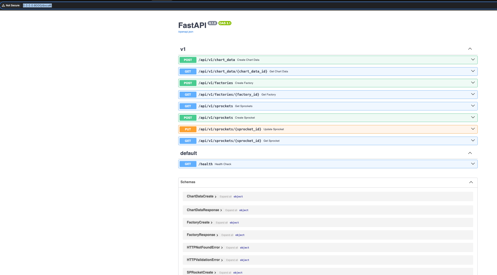

# POWERFLEX Technical Test

## Running the Project

### Prerequisites
- Docker and Docker Compose installed.
- Visual Studio Code (VSCode) installed.
- `make` installed to use in your terminal

### Configuration
1. Copy the content of `dev_template.env` to a new file named `dev.env`.
2. Fill in all the required credentials in `dev.env`. For postgres you can put anything you want.

### Clone project
3. Its recommended to clone the project using the option `Clone in VS Code`

### Startup
4. Open your terminal.
5. Run the following command in the terminal:
   ```bash
   make build
   ```
6. Run the following command in the terminal to check if containers are up:
   ```bash
   docker ps
   ```
7. After the containers are up, we need to wait around 1 or 2 minutes to run in root to init db correctly and apply migrations:
   ```bash
   make init
   ```
If you find a ConnectionRefused is because you need to wait a couple of seconds more while postgres container is ready


8. Please after running `make init` successfully run again `make build` to guarantee the app is connected to db

### Viewing Logs
8. To view the logs of the app, run:
   ```bash
   docker logs -f --tail 100 api
   ```

### If you want to open the code inside devcontainer: VSCode Configuration (Mac)
9. Press `CMD + SHIFT + P` inside VSCode.
10. Select "Reopen Folder and Build Container" from the options.
11. Choose the `devcontainer.json` file inside the `.devcontainer` folder.


### Clean project
12. If you want to delete containers:
   ```bash
   make down
   ```

13. If you want to remove database go to `.devcontainer` folder and remove `db_data` directory
14. If you want to see the database and browse it this project has a container for `pgadmin` so:
    - Go to: `http://localhost:5050`
    - Use the credentials you setup in dev.env for pgadmin
    - Add a new server
    - 
    - In `name` you can put whatever you want
    - I `connection tab` in hostname you must put `database`
    - 
    - In `maintenance database` put the name of your db of `dev.env` referring to POSTGRES
    - `Username` the same one from `dev.env` referring to POSTGRES
    - `Password` the same one from `dev.env` referring to POSTGRES
    - 
    - Finally, you will have something like that


15. If you want to see the docs for the endpoints:
    - Go to: `http://localhost:8000/docs`
    - 

   
### To check the tests
16. You can run:
   ```bash
   make run_tests
   ```
